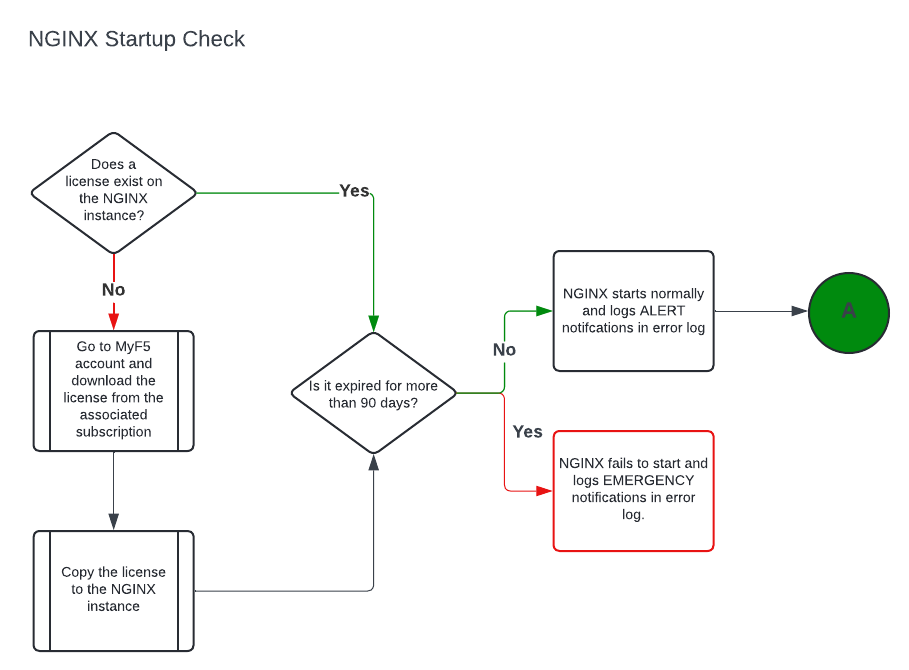
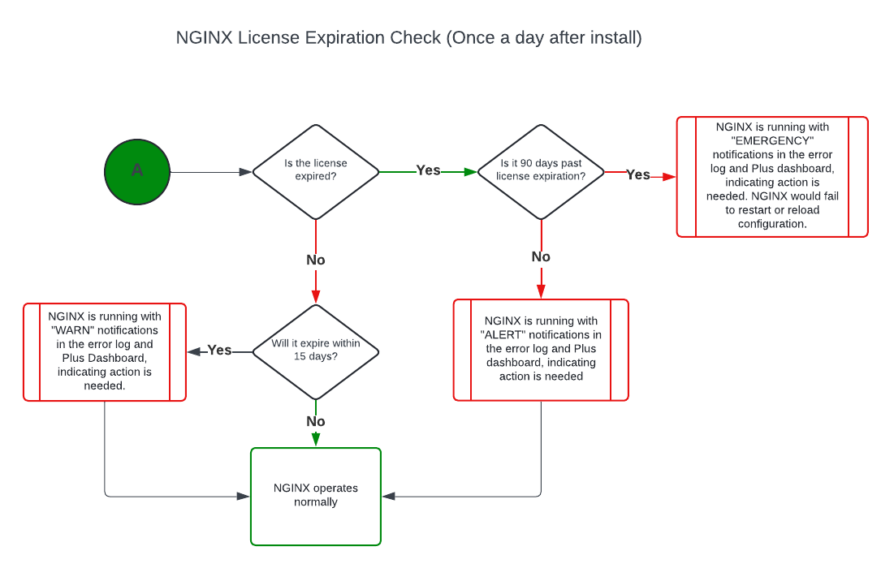
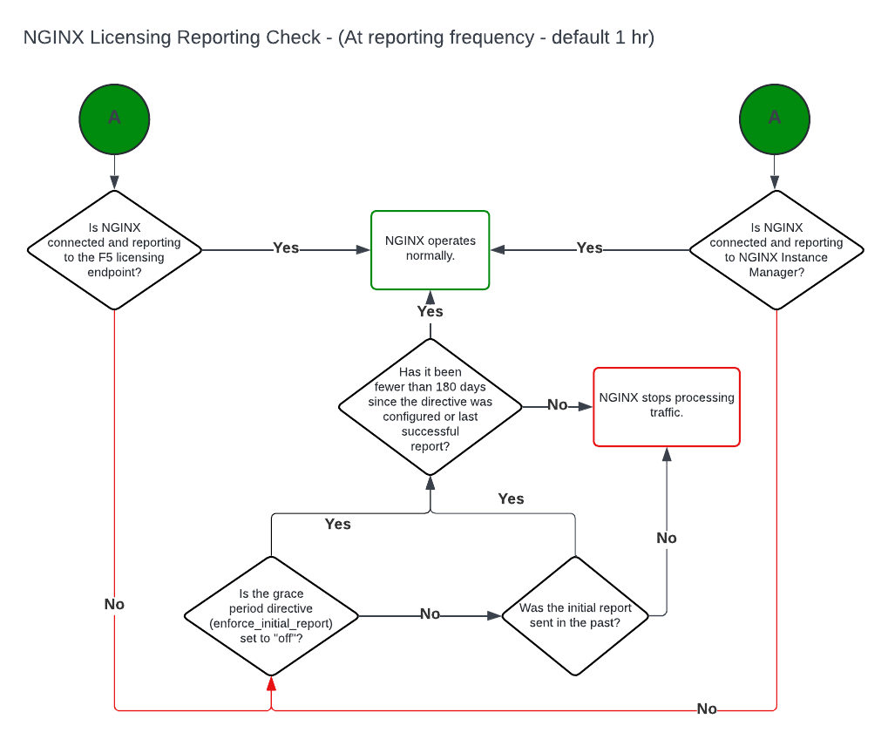
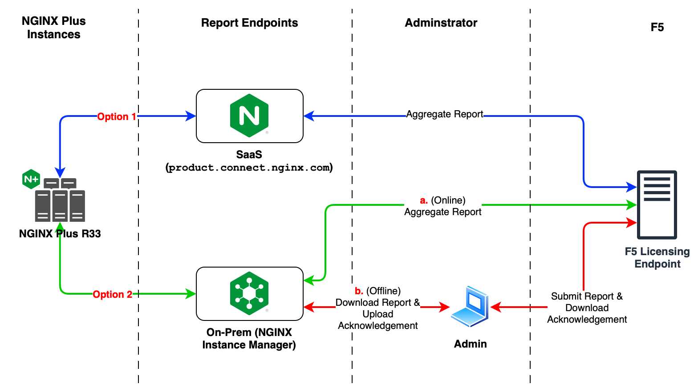
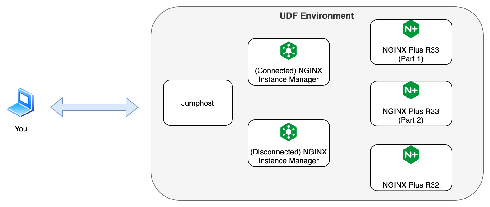

## Welcome

Welcome to the NGINX Plus R33 Upskill Lab.

There will not be a live session for this upskill session and all content will be provided in this lab.

### Agenda

The goals of this upskill session is

- Demonstrate licensing changes starting with NGINX Plus R33

---

## NGINX Plus R33

### Background

The NGINX Plus Release 33 requires that all instances have a valid **JSON Web Token (JWT)** license. The license is linked
to the subscription but not the individual instance of NGINX Plus. The NGINX Plus instance will also automatically send
usage reports to F5’s licensing endpoint, **product.connect.nginx.com**.  The usage reports are a requirement of all current
license agreements. In the case of environments with no direct access to the F5 licensing endpoint, customers can generate the
reports using NGINX Instance Manager or use NGINX Instance Manager to proxy the reports to the F5 licensing endpoint.

All NGINX Plus customers (new and existing) are required to include the entitlement artifact **JWT** in their NGINX Plus
installation.  The JWT can be downloaded from the MyF5 account associated to the NGINX Plus license. There is a built-in
90-day grace period at the end of all NGINX Plus subscriptions.

> **Note:** No application traffic would be impacted even after the 90-day grace period expiration until NGINX is restarted.

In addition to having a valid JWT included in the NGINX Plus installation, each instance is required to submit a report at
least once every 180 days to prevent NGINX from dropping new connections. The usage reports are submitted by default to
**product.connect.nginx.com**. NGINX Plus installs without access to the F5 licensing endpoint can submit them to NGINX
Instance Manager. The NGINX Instance Manager can send the reports to the F5 licensing endpoint or the Administrator can
generate the report manually and submit it to the F5 licensing endpoint.

### Workflow

Starting on R33, there will be two aspects that will be enforced. We will go over workflow details of Entitlement &
Visibility (E&V).

1. A valid JWT that is less than 90-days must be present for **nginx** to start.
1. Once **nginx** starts, the usage report must be submitted with a max interval of 180-days.
    - If your environment cannot submit usage reports, you can set a directive within the **mgmt** block that allows
    180-days to submit the first report.

#### License

We will cover two licensing workflows in this section.

The first workflow is a detailed view checking if a valid JWT exist and if it is less than 90 days expired.

The key point here is:
- **nginx** starts only if there is a valid JWT and it is no more than 90 days expired

 

The second workflow below is a detail view after **nginx** started showing periodic checks if the JWT has expired.

Some key points here are:
- When the JWT is within 15 days of expiring, `WARN` messages appear in `error.log`
- When the JWT is expired but under the 90-day grace period, `alert` messages appear in `error.log`
- When the JWT is past 90 days expired, `emergency` messages appear in `error.log`

 

#### Usage report

The workflow diagram below show details relating to submitting the usage report at most 180 days.

Some key points here are:
- The usage report endpoint configuration must be set to the F5 license endpoint or NGINX Instance Manager (NIM).
- If a usage report is successfully submitted, you have at most 180 days until you submit another one.
  - If not, NGINX will stop processing traffic.
- If you are unable to submit a usage report, you can set the  `enforce_initial_report off;` directive which allows you
180 days to submit a report.
  - If you don't, NGINX will stop processing traffic.

 

### Data Reported by NGINX

NGINX Plus will collect and report following data starting with R33. This data is encrypted and sent from each NGINX instance to
the F5 licensing endpoint or NIM which can then send the data to the F5 licensing endpoint or the Administrator can manually
generate the report and submit it to F5. The usage report contains the following list of metrics.

- NGINX version
- NGINX App Protect Status
- Instance UniqueID
- Bytes received by/sent to clients (http, stream)
- Number of requests handled (http)
- Bytes received from and sent to upstreams (http, stream)
- Number of accepted connections (http, stream)
- Number of workers running at the time of report
- NGINX Uptime (in seconds)
- NGINX Reloads during uptime
- Collection start and end time.

 

### Submitting NGINX Usage Report

The following are three options that can be used for reporting NGINX usage to the F5 Licensing Endpoint:

1. (Automatic) NGINX Plus with internet access reports to F5 Licensing Endpoint
1. (Automatic) NGINX Plus managed by a NGINX Instance Manager (NIM) connected to the internet submits usage reports to
the F5 Licensing Endpoint
1. (Manual) NGINX Plus managed by a disconnected NGINX Instance Manager (NIM), both restricted from internet access.
Additional resources is required to submit usage reports, either you manually do this or automate this using a script.
    - Downloading NGINX usage report from NIM and submitting it to F5
    - Downloading license acknowledgement report from F5 and uploading it to NIM

Take a look at the diagram below that shows the entire view of the options we went over.

From the perspective of the NGINX Plus R33 instance, two endpoints are available for usage reports:
1. Using the SaaS endpoint, **product.connect.nginx.com**
1. Using an on-prem NIM endpoint

#### Option 1: NGINX Plus connected to internet

You can refer to the path shown as **Option 1** in the diagram above. This is the simplest of the three where there are no
restrictions for the NGINX Plus instance and it can connect to the F5 SaaS endpoint directly. You are not required to
take any manual actions in this option.

#### Option 2a: NGINX Plus managed by NIM connected to internet

In situations where the NGINX Plus instance is restricted access to the internet or it is blocked from connecting
to **product.connect.nginx.com**, **Option 2a** is another one. In this design, your NGINX Plus instance managed by NIM is
connected to the internet. NIM then reports your NGINX Plus usage to the F5 Licensing Endpoint automatically. Like
**Option 1** you are not required to take any manual actions when submitting the usage report.

#### Option 2b: NGINX Plus and NIM fully disconnected

If your security policies require a fully disconnected environment where your NGINX Plus instance and NIM is in a
network restricted environment, the NGINX Plus instance still needs to be managed by NIM. The administrator MUST manually
generate the NGINX Plus usage report and submit it to the F5 Licensing Endpoint. The person will then download the license
acknowledgement report from F5 and upload it to NIM.

> A script is also provided on NGINX Instance Manager documentation within the
[Report usage to F5 in a disconnected environment](https://docs.nginx.com/nginx-instance-manager/disconnected/report-usage-disconnected-deployment/#submit-usage-report)
page.

### Connection details

When implementing **Option 1** you have to allow egress and ingress traffic from the NGINX Plus instance to
**product.connect.nginx.com**.

| Type     | Value                                    |
| -------- | ---------------------------------------- |
| Port     | 443                                      |
| Protocol | HTTPS                                    |
| Hostname | `product.connect.nginx.com`              |
| IPs      | **3.135.72.139**, **3.133.232.50**, **52.14.85.249** |

When implementing **Option 2a** or **Option 2b**, you have to allow egress and ingress traffic from NIM or the device
with internet access to the **F5 Licensing Endpoint**.

| Type     | Value                                    |
| -------- | ---------------------------------------- |
| Port     | 443                                      |
| Protocol | HTTPS                                    |
| Hostname | `product.apis.f5.com` and `product-s.apis.f5.com`               |
| IP       | **35.199.173.84** |

 

---

## Upskill session layout

In these sessions, we are breaking the labs into into the following sections below.

- Demo
- Interactive
- Fix It

### Demo

You watch a video where we show you one way of configuring the endpoint on the NGINX instance to an F5 License
Endpoint where the NGINX instance has internet connectivity.

### Interactive

This lab has 2 parts where you will setup the NGINX instance uses NIM as the usage report endpoint.
- The first part has NIM in an environment with internet access
- The second part has NIM in a network restricted environment. We  will go through the steps of setting up and manually
submitting the usage report because both the NGINX instance and NIM do not have internet access.

### Fix it

The last portion will be the Fix It Lab where you do an upgrade from NGINX Plus R32 to R33.

### Environment

The diagram of the lab environment is shown below.

This UDF Blue Print contains the following systems.
1. Jumphost
1. NGINX Plus Instance R33 (for interactive lab part 1)
1. NGINX Plus Instance R33 (for interactive lab part 2)
1. (Connected) NGINX Instance Manager 2.18
1. (Disconnected) NGINX Instance Manager 2.18
1. NGINX Plus Instance R32 (for R32 to R33 upgrade)

> :warning: **Note:** The UDF environment does not support a true disconnected environment. So when we do the
interactive lab, we will go through steps as if NGINX Plus and NIM are fully disconnected to the internet but do note
they have internet connectivity.

---

## Use Cases

For the NGINX Plus R33 release, there will only be one main use case:

1. Entitlement and Visibility (E&V), aka licensing NGINX Plus

In each of the labs, we will be going over the different ways of handing E&V:

1. NGINX Plus connecting directly to F5 Licensing Endpoint
1. NGINX Plus in a network restrictive environment connecting to
    - NIM with internet connectivity
    - NIM also in a network restrictive environment
1. Handing upgrade to NGINX Plus R33

---

## Additional information

We are basing most of the information of this lab from the following sources.
- [NGINX Plus R33 Pre-release Guidance](https://docs.nginx.com/solutions/)
- [NGINX Plus R33 Subscription License](https://docs.nginx.com/solutions/about-subscription-licenses/)
- [NIM - Offline Installation](https://docs.nginx.com/nginx-instance-manager/disconnected/offline-install-guide/)
- [NIM - Offline License and Activation](https://docs.nginx.com/nginx-instance-manager/disconnected/add-license-disconnected-deployment/)
- [NIM - Report Usage Offline](https://docs.nginx.com/nginx-instance-manager/disconnected/report-usage-disconnected-deployment/)

## Up next

Since the JWT is a focus of this release, let's get through the steps of getting it by [clicking here](r33-2.mdx).
