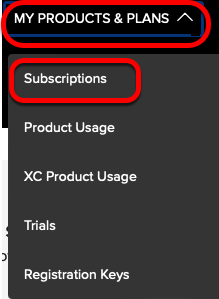
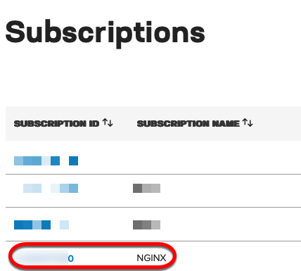
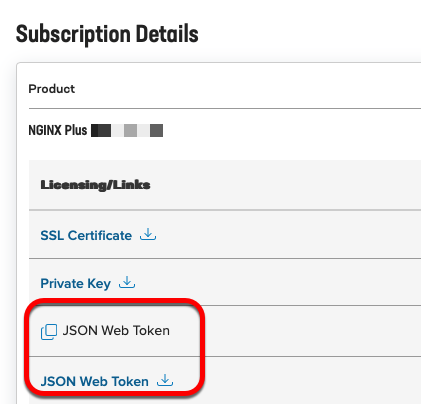

## Introduction

This section will go through steps for how you would obtain the JWT to license NGINX Plus R33. The place where you would
get this is from [MyF5](https://www.myf5.com).

## JWT for NGINX Plus

### JWT via MyF5

Starting on NGINX Plus R33, you are required to use a valid JWT in order to use this. Take the following steps below
to get it.

1. Go to [MyF5](https://www.myf5.com) and sign in or sign up if you do not have one.
1. On top of the page select **MY PRODUCTS & PLAN** then **Subscriptions**.

1. Find your **NGINX** subscription and select it.

1. You will now be on a page where you can either **Copy** or **Download** your JWT in the *Subscription Details*.

> If you are a customer and do not see a JWT to copy or download, reach out to your sales or support contact.

> If you do not see a subscription for NGINX, go to [this page](https://go/sde-r33-jwt) for
information on how to get it, **VPN** required. Follow steps for option 1.

## Up Next

You now have the JWT required for NGINX Plus R33 and can proceed to the Demo labs where we demonstrate how to configure
submitting the usage report on your NGINX Plus instance connected to the internet. In addition to that, we demonstrate
different behaviors for Entitlement & Viability. [Click here](r33-3.mdx) to proceed.
