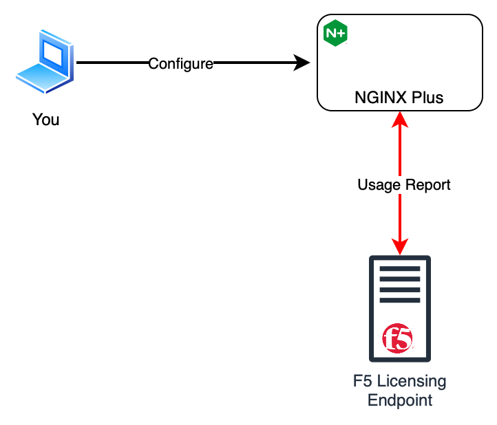

## Introduction

We will be going through a demo when you are in an environment connected to the internet. You can either:

1. Configure NGINX Plus to submit usage report directly to the F5 license server
1. Configure NGINX Plus to submit usage report to NGINX Instance Manager (NIM) which will submit the report to the F5
license server

This demo video will go through the option 1. Shown below is a component diagram that shows an overview of how the
usage report is being submitted.

## Demo Lab

Remember there are two areas thats introduced starting on r33
1. You must have a valid JWT and that JWT must be within the 90-day grace period for NGINX to starting.
1. Once NGINX started, a report must be submitted with an interval of at most 180 days.

This demo video will show the following parts:
1. Configuring NGINX Plus to connect to F5 license server
1. Show the new NGINX Plus behavior in regards to the JWT license.
    - NGINX Plus startup without JWT
    - NGINX Plus behavior as the expiration date nears.
1. Show NGINX Plus behavior in regards to submitting the usage report.
    - NGINX Plus behavior when a failure occurs when submitting the usage report but you are within the 180-day grace
    period
    - NGINX Plus behavior after 180 day period

> TODO: This need to open a new window because you cannot click back.
[PLACEHOLDER Video link](https://f5.sharepoint.com/:v:/s/gscoe/ESHEZ24sDuRBpIpjz6thMNsBTZLcFCuuvujokU4pH_qDdw?e=zBGEFd)

## Summary

After watching this video, you now understand:
1. How to configure endpoint where to submit usage report.
1. Understand NGINX Plus with the JWT
1. Understand NGINX Plus behavior with submitting usage report.

## Conclusion

Now that you understand how to configure the reporting endpoint, let's proceed to the next lab where we will work on
steps for submitting the usage report to the F5 license server in a fully disconnected environment in the disconnected
lab. [Click here](r33-4.mdx) to proceed to that.
