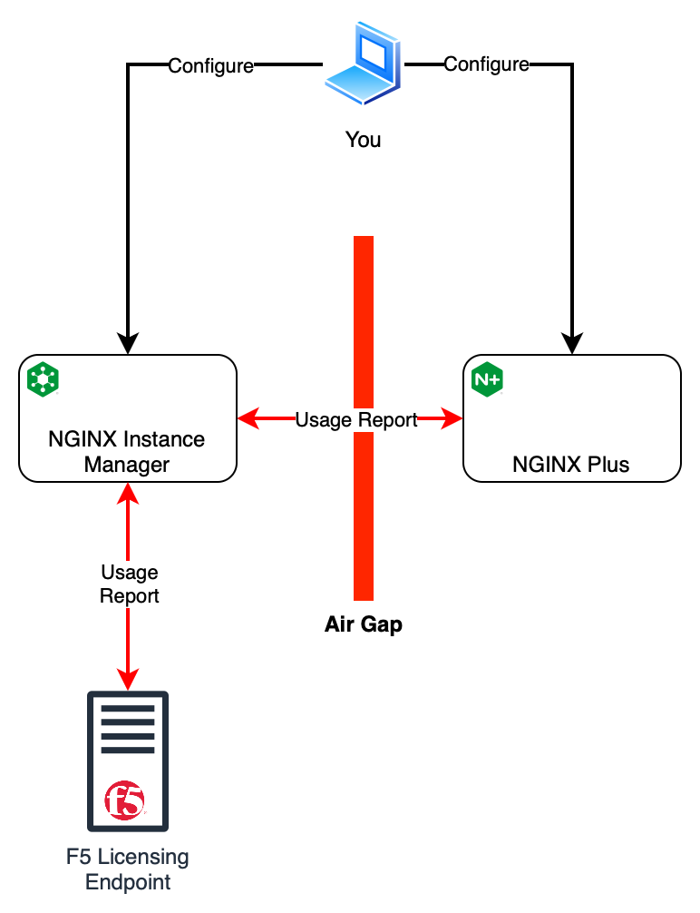
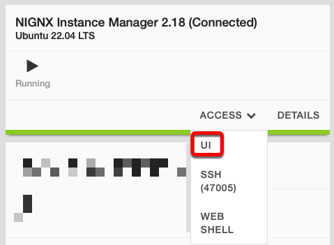
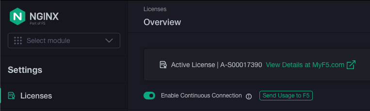

## Introduction

:bangbang: Be sure your UDF deployment is using at least *SDE NGINX Plus R33 Upskilling (**version 19**)*

In this lab, we will be going through a scenario where the NGINX Plus instance is in a network restricted environment.
Since it does not have internet connectivity, it needs to be configured to use NIM as the usage report endpoint. This
lab will go through configuring this environment where NIM has internet connectivity.

The goal of this section will be to:
- Become familiar configuring NGINX Plus R33 with NIM as the usage report endpoint.

The diagram below shows the component view of this lab.



> **Note:** Although we are going through this lab as if NGINX Plus is in a network restricted environment, it really
does have internet access in this UDF environment.

## Lab environment notes

> Windows users need to **Ctrl** + **Shift** + **v** to paste commands into the *Web Shell*.

Firefox does not handle **Web Shell** well. The current line drops below the bottom of the screen making it difficult to work with.

## Interactive Lab Part 1

Let's now go through this scenario where you will configure NGINX Plus so that the usage report endpoint is set to NIM.

### NIM

NIM is already installed and licensed so no need to configure anything here. You can log in the NIM UI via UDF to check
the status.

1. Open up the **UI** to the **NGINX Instance Manager (Connected)** instance in UDF. The log in credentials is
admin / Password123!


1. You can navigate to License Setting by selecting the Setting icon on top. You should be taken to the Licenses page
shown below.


### NGINX Plus R33

Let's now proceed to installing NGINX Plus R33 and configuring the usage report endpoint to NIM instead of the default
F5 SaaS endpoint.

The prerequisites for installing NGINX Plus is already complete so all you need to do is install it.

1. From UDF, open up a **Web Shell** for your **NGINX Plus R33 (Part 1)** instance.

1. Install NGINX Plus by running the commands below.
    ```shell
    apt update
    apt install nginx-plus
    ```

    > Windows users need to **Ctrl** + **Shift** + **v** to paste commands into the *Web Shell*.

1. Create the JWT file at `/etc/nginx/license.jwt` using the JWT you got from MyF5 using your editor of choice. You can
do this by one of the following ways:
    - `echo '<contents of your JWT file>' > /etc/nginx/license.jwt`
    - You can also open a blank file named `/etc/nginx/license.jwt` and paste the contents of the JWT file.

1. Open `/etc/nginx/nginx.conf` using your editor of choice.

1. On the bottom the file, you should notice the `mgmt` section is commented out. Update the config file with the
following **mgmt** section. We will be doing the following:
    - Set the **usage_report** endpoint to `nim-connected.lab.f5npi.net` which is our NIM instances
    - Set a quicker **interval** so we can see the frequency in the NGINX logs.
    ```shell
    mgmt {
      usage_report endpoint=nim-connected.lab.f5npi.net interval=30s;
    }
    ```

    > **NOTE:** This environment uses a valid signed certificate from LetsEncrypt because we want to keep **ssl_verify**
    enabled. This is already setup and no actions are needed by you but if you want additional details enabling
    **ssl_verify** with NIM, click on the **Show** button below.

    <Collapsible title="SSL Verify with NIM Details">
    <br/>
    The following are two methods of how you can enable **ssl_verify** within this lab environment.
    * Signed certificates
    * Self-signed certificates

    #### Signed Certificate

    This lab environment uses a valid signed certificate from **LetsEncrypt**. Of the certificates LetsEncrypt created,
    two are used: `fullchain.pem` and `privkay.pem`. These files are copied to the NIM instances located in
    `/etc/nms/letsencrypt`.

    <br/>
    <br/>

    The NIM ssl certificate configuration is then updated. A snippet of this is shown below.

    ```shell
    $ cat /etc/nginx/conf.d/nms-http.conf
    . . .
    # Main external HTTPS server
    server {
        . . .

        ssl_certificate         /etc/nms/letsencrypt/fullchain.pem;
        ssl_certificate_key     /etc/nms/letsencrypt/privkey.pem;
    }
    ```

    <br/>
    #### Self-Signed Certificate

    If you wish to use a self-signed certificate, follow instructions from the [Configure SSL verification for usage reporting with self-signed
    certificates](https://docs.nginx.com/nginx-instance-manager/system-configuration/secure-traffic/#trusting-self-signed-certificates)
    guide.
    <br/>
    <br/>
    The SSL configuration in the **mgmt** block of the NGINX Plus R33 instance uses the self-signed CA certificate and
    SSL config from NIM which were created during the NIM installation. So here, the CA certificate is copied from NIM
    to the NGINX Plus R33 instance. That CA certificate is referenced in `ssl_trusted_certificate`. And the `ssl_name`
    used is **manager-server**. An snippet of the **mgmt** block looks like the following.

    ```shell
    mgmt {
      usage_report endpoint=nim-connected.local;
      ssl_trusted_certificate /full/path/to/ca/copied/from/nim/ca.pem;
      ssl_name manager-server;
    }
    ```

    </Collapsible>


1. On the top of the `/etc/nginx/nginx.conf` file, change the `error_log` to `debug`. Below is the example where the
**error_log** is set to `debug`.
    ```shell
    error_log  /var/log/nginx/error.log debug;
    ```

1. You can now save these changes.

1. Finally start NGINX Plus.

    ```shell
    systemctl start nginx
    ```

1. You should now notice the `info` line in `/var/log/nginx/error.log` showing the usage report was sent to NIM.

    <Collapsible title="Example Output">
    ```shell
    root@plus1:/# tail -f /var/log/nginx/error.log
    2024/10/31 07:20:58 [notice] 9833#9833: using the "epoll" event method
    2024/10/31 07:20:58 [notice] 9833#9833: nginx/1.27.2 (nginx-plus-r33)
    2024/10/31 07:20:58 [notice] 9833#9833: built by gcc 11.4.0 (Ubuntu 11.4.0-1ubuntu1~22.04)
    2024/10/31 07:20:58 [notice] 9833#9833: OS: Linux 5.19.0-1026-aws
    2024/10/31 07:20:58 [notice] 9833#9833: getrlimit(RLIMIT_NOFILE): 1024:524288
    2024/10/31 07:20:58 [notice] 9834#9834: start worker processes
    2024/10/31 07:20:58 [notice] 9834#9834: start worker process 9835
    2024/10/31 07:20:58 [notice] 9834#9834: start worker process 9836
    2024/10/31 07:20:58 [info] 9835#9835: usage report was sent
    ```
    </Collapsible>

Great! You now configured your NGINX Plus instance to use NIM as your new usage report endpoint!

## Logs

Let's now look at the logs. There are two components where you can view usage reporting logs when troubleshooting.

1. NGINX Plus Instance
1. NGINX Instance Manager

### NGINX Plus

Any logs messages relating to submitting usage reports from the NGINX Plus instance to NIM can be found in the
**error_log** directive. Since I am using the default values, it is located in `/var/log/nginx/error.log`.

If there are any issues when submitting the usage report, you will see **error** level log lines.

You may also see **alert** level logs along with the error. Below is an example of an error when the NGINX Plus instance
failed to submit a report to NIM because it is unable to verify the TLS certificate.

```log
2024/12/18 07:19:40 [error] 1801#1801: certificate verify error: (21:unable to verify the first certificate) for 10.1.1.9:443 during usage report
2024/12/18 07:19:40 [alert] 1801#1801: cannot send usage report; traffic processing will degrade in 149 days
```

> You will see an error here if there is an issue when NGINX Plus tries to submit its usage report to NIM. In
my example here, I did not properly configure TLS hence we saw a certificate error.

<br/>

When the usage report is successfully submitted, you will see **info** level log messages. Below is an example of a
report that was successfully sent to NIM.

```log
2024/12/04 20:53:25 [info] 2234#2234: usage report was sent
```

### NGINX Instance Manager

Another area where you can look for log messages related to usage reports can be found on NIM. You may need to adjust
NIM's log level setting in `/etc/nms/nms.conf`. Below is an example of NIM's log config. Be sure to restart **nms** if
you made a change.
```yaml
log:
  level: debug
```

For the example here, I used the default log location in `/etc/nms/nms.log`.

If there are any issues submitting the usage report from NIM to the F5 Licensing Endpoint, you will see **WARN** and
**INFO** log messages coming from **DPM**. In my example here, I changed the time on the NGINX Plus instance to about
100 days in the future, command I ran shown below. This causes issues when the F5 Licensing Endpoint check timestamps.
```shell
sudo timedatectl set-ntp no && sudo date -s "+100 day"
```

Below is an example of the **WARN** and **INFO** log messages that resulted from changing the date.

```log
Nov 14 20:22:56 nim <DPM>[2667]: 2024-11-14T20:22:56.303Z	INFO	e3f55948-d3d7-4ff5-bcbc-96315529c988	usage/impl.go:200	failed to parse request body: bad request: end report time should not be before start time
Nov 14 20:22:56 nim <DPM>[2667]: 2024-11-14T20:22:56.303Z	WARN	e3f55948-d3d7-4ff5-bcbc-96315529c988	usage/impl.go:148	NGINX usage tracking: bad request: end report time should not be before start time, entry not created
```

You are also able to see **DEBUG** log messages when a report is successfully submitted to NIM from NGINX Plus.

```log
Nov 14 20:23:26 nim <DPM>[2667]: 2024-11-14T20:23:26.344Z	DEBUG	9813c201-6951-4926-98c1-c743fc17f1fa	usage/impl.go:163	NGINX usage tracking: new report with &{Version:1.27.2 Hostname:<nil> UUID:2159d15f-00d6-6684-8da1-a9680b2e5765 NAP:inactive DOS: ProductType:nginx-plus K8sClusterID:<nil> K8sInstallationID:<nil> JWTTokenID:0xc0011bb080 Time:2024-11-14 20:23:26.344311727 +0000 UTC m=+85.406709833}
```

## Summary

After completing this lab, you are now able to:
1. On NGINX Plus R33, configure usage report endpoint to NIM
1. View E&V logs on NGINX Plus and NGINX Instance Manager

## Up next

Now that you understand how to configure the usage report endpoint where NIM has internet connectivity, let's proceed to
the next lab where we will work on a lab where NIM is also disconnected like NGINX Plus. [Click here](r33-5.mdx) to
proceed to that.
