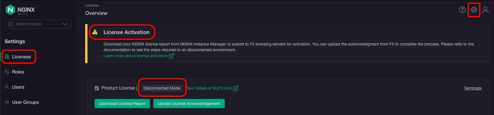
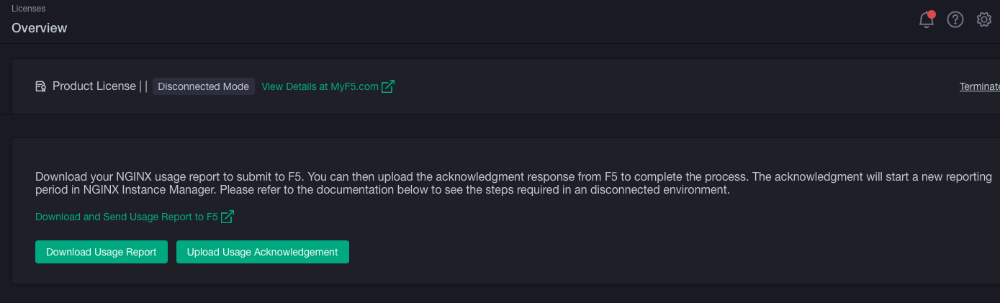

## Introduction

We will be going through an interactive lab where you will be working on a scenario where the NGINX Plus instance
and the NGINX Instance Manager (NIM) is completely air-gapped. This is a disconnected environment where the
organization's security policy requires these two components to be disconnected from any access from the internet.

> NOTE: This lab is created in UDF and all components are connected to the Management network, which is routed
to the internet, by default. We will be going through the exercise here as if NIM and NGINX Plus are disconnected but
do know they really do have internet connectivity in this lab.

The diagram below shows the network overview of this portion of this lab. Again, NGINX Plus and NIM here really have
internet connectivity but will go through as if they do not.


The diagram below shows the component view and a main workflow one would do from a Jumphost.


## Lab environment notes

> Windows users need to **Ctrl** + **Shift** + **v** to paste commands into the *Web Shell*.

Firefox does not handle **Web Shell** well. The current line drops below the bottom of the screen making it difficult to work with.

## Prerequisites

1. NGINX R33 JWT

## Interactive Lab

Let's get into this. An overview of steps we will be doing in this lab are listed below.

1. NIM license is applied but it is not activated
1. Configure NGINX Plus to report to NIM as the endpoint
1. Handle submitting the usage report from a **Jumphost**, which has internet connectivity, to the F5 Licensing Endpoint

> The extra manual steps for submitting the usage report is automatically handled if NGINX Plus or NIM have internet
connectivity. But because we are covering a case where NGINX and NIM are in restricted network, you must manually
complete these steps from a device that have internet connectivity.

> You have up to 180 days to submit a report to F5.

### NIM activation

Why is NIM being used in this scenario? Remember NGINX Plus R33 will require usage reports being sent to an F5 SaaS or
NIM endpoint. Because NGINX Plus is air-gapped, we must use NIM as the endpoint.

Why do we have to activate NIM? The scenario here also requires NIM to be air-gapped as well as NGINX Plus. The
license activation process does happen automatically when it is connected to the internet but for the case here, we must
manually handle the activation process. The steps here goes through those manual steps.

This lab already has NIM install with a license but it isn't activated. Let's look at the NIM UI to confirm this is
licensed but not activated.

1. In your UDF Deployment, select the Component tab then find **NGINX Instance Manager 2.18**
  

1. Select **ACCESS** then **UI**. A new window should open taking you to the NIM UI.
  

1. Select **Sign In** then provide the following credentials: admin / Password123!
  

1. In the top right corner, select the Settings icon and confirm you are on the Licenses menu on the left. Notice NIM is
already configured in **Disconnected Mode**. Also notice the warning message regarding License Activation.

  > Details for configuring NIM for **Disconnected Mode** can be found the in
  [Set the operation mode to disconnected](https://docs.nginx.com/nginx-instance-manager/disconnected/offline-install-guide/#set-mode-disconnected)
  section of the NIM Offline Installation Guide.

  

Let's now go through the manual activation process.

1. Log into the **Web Shell** of your **Jumphost**.

1. We will save your NGINX R33 JWT as an environment variable for ease. This will be used as your auth token when making
REST API calls to the F5 Licensing Endpoint.
    ```shell
    export LICENSE=<PasteJWTValueHere>
    ```

1. We will also be saving the *Basic Authorization* token when making REST API calls to NIM. Any `curl` commands for NIM
will use this token.
    ```shell
    export NIM_AUTH_TOKEN=`echo -n "admin:Password123!" | base64`
    ```

1. Run the following command to download the initial usage report. In the example below, we are downloading the license
report to a file named `license_report.zip`.
    ```shell
    curl -k --location \
      'https://nim.local/api/platform/v1/report/download?format=zip&reportType=initial&telemetryAction=download' \
      --header "Authorization: Basic $NIM_AUTH_TOKEN" \
      --output license_report.zip
    ```

1. Run the following command to submit the usage report to the  F5 Licensing Endpoint for verification.
    ```shell
    curl --location -s \
      'https://product.apis.f5.com/ee/v1/entitlements/telemetry/bulk' \
      --header "Authorization: Bearer $LICENSE" \
      --form 'file=@"license_report.zip"' | jq
    ```

    :warning: Pay attention to the UUID of the *statusLink* value. You will be using this for future `curl`
    commands. In the example here, it is **7b926064-3360-4354-86d8-79b390efd178**. You can see an example response
    below.

    <Collapsible title="Example Output">
    ```shell
    root@lab-framework:~$ curl --location -s \
      'https://product.apis.f5.com/ee/v1/entitlements/telemetry/bulk' \
      --header "Authorization: Bearer $LICENSE" \
      --form 'file=@"license_report.zip"' | jq
    {
      "statusLink": "/ee/v1/entitlements/telemetry/bulk/status/7b926064-3360-4354-86d8-79b390efd178",
      "pollIntervalInSeconds": 30,
      "validUntilDate": "2024-11-06T23:33:29.853Z"
    }
    ```
    </Collapsible>

1. Run the command below to check if the report is successfully uploaded and if the acknowledgement report is ready for
download. Remember to swap out **\<report-id\>** for the **UUID** you got from the response when you submitted the usage
report to the F5 Licensing Endpoint.
    ```shell
    curl --location -s \
      'https://product.apis.f5.com/ee/v1/entitlements/telemetry/bulk/status/<report-id>' \
      --header "Authorization: Bearer $LICENSE"  | jq
    ```

    <Collapsible title="Example Output">
    ```shell
    root@nim:~$ curl --location -s \
      'https://product.apis.f5.com/ee/v1/entitlements/telemetry/bulk/status/7b926064-3360-4354-86d8-79b390efd178' \
      --header "Authorization: Bearer $LICENSE"  | jq
    {
      "percentageComplete": 100,
      "percentageSuccessful": 100,
      "readyForDownload": true,
      "downloadLink": "/ee/v1/entitlements/telemetry/bulk/download/7b926064-3360-4354-86d8-79b390efd178"
    }
    ```
    </Collapsible>

1. Run the following to download the license acknowledgment report from F5. In the example below, we are downloading the
report to a file named `lic_acknowledgement.zip`. Remember to swap out **\<report-id\>** for the **UUID** you got from
the response when you submitted the usage report to the F5 Licensing Endpoint.
    ```shell
    curl --location -s \
      'https://product.apis.f5.com/ee/v1/entitlements/telemetry/bulk/download/<report-id>' \
      --header "Authorization: Bearer $LICENSE" \
      --output lic_acknowledgement.zip
    ```

1. Now finally, run the following to upload the license acknowledgment report to NIM.
    ```shell
    curl -k --location -s \
      'https://nim.local/api/platform/v1/report/upload' \
      --header "Authorization: Basic $NIM_AUTH_TOKEN" \
      --form 'file=@"lic_acknowledgement.zip"' | jq
    ```

    <Collapsible title="Example Output">
    ```shell
    root@lab-framework:~$ curl -k --location -s \
      'https://nim.local/api/platform/v1/report/upload' \
      --header "Authorization: Basic $NIM_AUTH_TOKEN" \
      --form 'file=@"lic_acknowledgement.zip"' | jq

    {
      "manifest": "...",
      "message": "Report uploaded successfully."
    }
    ```
    </Collapsible>

1. You have now licensed NIM and submitted the initial usage report. Go back to your NIM UI and refresh your page.
Notice the License Activation warning is now gone.
  

> We've went through manual steps for activating NIM license and submitting the initial usage report. There is also
a script available on the
[Add a license in a disconnected environment](https://docs.nginx.com/nginx-instance-manager/disconnected/add-license-disconnected-deployment/)
page from NGINX Instance Manager documentation.

Let's proceed to setup NGINX Plus so the endpoint is going to NIM instead of the default `product.connect.nginx.com`.

### Configure NGINX Plus report endpoint

The prerequisites for installing NGINX Plus is already setup so all you need to do is install it.

1. From UDF, open up a **Web Shell** for your **NGINX Plus R33 (Disconnected)** instance.

1. Install NGINX Plus by running the commands below.
    ```shell
    apt update
    apt install nginx-plus
    ```

1. Create the JWT file at `/etc/nginx/license.jwt` using the JWT you got from MyF5 using your editor of choice. You can
do this by one of the following ways:
    - `echo '<contents of your JWT file>' > /etc/nginx/license.jwt`
    - You can also open a blank file named `/etc/nginx/license.jwt` and paste the contents of the JWT file.

1. Open `/etc/nginx/nginx.conf` using your editor of choice.

1. On the bottom the file, you should notice the `mgmt` section is commented out. Update the config file with the
following **mgmt** section. We will be doing the following:
    - Set the **usage_report** endpoint to `nim.local` which is our NIM instances
    - Set a quicker **interval** so we can see the frequency from the NGINX logs.
    - Disable **ssl_verify**
    ```shell
    mgmt {
      usage_report endpoint=nim.local interval=10m;
      ssl_verify off;
    }
    ```

    > :warning: It is not advisable to disable `ssl_verify`. We are taking the risk here because this is a fully
    disconnected environment.

1. On the top of the `/etc/nginx/nginx.conf` file, change the `error_log` to `debug`. Below is the example where the
**error_log** is set to `debug`.
    ```shell
    error_log  /var/log/nginx/error.log debug;
    ```

1. You can now save these changes.

1. Finally start NGINX Plus.

    ```shell
    systemctl start nginx
    ```

1. You should now notice the `info` line from the `/var/log/nginx/error.log` showing the usage report was sent to NIM.

    <Collapsible title="Example Output">
    ```shell
    root@ip-10-1-1-5:~$ tail -f /var/log/nginx/error.log
    2024/10/31 07:20:58 [notice] 9833#9833: using the "epoll" event method
    2024/10/31 07:20:58 [notice] 9833#9833: nginx/1.27.2 (nginx-plus-r33)
    2024/10/31 07:20:58 [notice] 9833#9833: built by gcc 11.4.0 (Ubuntu 11.4.0-1ubuntu1~22.04)
    2024/10/31 07:20:58 [notice] 9833#9833: OS: Linux 5.19.0-1026-aws
    2024/10/31 07:20:58 [notice] 9833#9833: getrlimit(RLIMIT_NOFILE): 1024:524288
    2024/10/31 07:20:58 [notice] 9834#9834: start worker processes
    2024/10/31 07:20:58 [notice] 9834#9834: start worker process 9835
    2024/10/31 07:20:58 [notice] 9834#9834: start worker process 9836
    2024/10/31 07:20:58 [info] 9835#9835: usage report was sent
    ```
    </Collapsible>

Great now you've setup your NGINX Plus instance so that it reports to NIM!

### Submitting usage report

By this point:
- NIM is licensed and activated.
- The initial report is submitted to the F5 Licensing Endpoint.
- NGINX Plus R33 is installed and is submitting usage reports to NIM.

We now need to submit the usage reports from NIM to the F5 License Server. We will now outline the steps to do this
below.

1. In UDF, open a **Web Shell** to the Jumphost.

1. Run the following command to NIM that starts rendering the usage report.
    ```shell
    curl -k --location -s \
      'https://nim.local/api/platform/v1/report/download?format=zip&reportType=telemetry' \
      --header 'accept: application/json' \
      --header "authorization: Basic $NIM_AUTH_TOKEN" \
      --header 'referer: https://nim.local/ui/settings/license' | jq
    ```

    <Collapsible title="Example Output">

    ```shell
    root@lab-framework:~$ curl -k --location -s \
      'https://nim.local/api/platform/v1/report/download?format=zip&reportType=telemetry' \
      --header 'accept: application/json' \
      --header "authorization: Basic $NIM_AUTH_TOKEN" \
      --header 'referer: https://nim.local/ui/settings/license' | jq

    {
      "telemetry":"Report generation in progress"
    }
    ```
    </Collapsible>

1. After a few seconds, run the following command below to download the report on to the **Jumphost**. In the example
here, the usage report is downloaded as a zip file named `usage.zip`.
    ```shell
    curl -k --location \
      'https://nim.local/api/platform/v1/report/download?format=zip&reportType=telemetry&telemetryAction=download' \
      --header 'accept: */*' \
      --header "authorization: Basic $NIM_AUTH_TOKEN" \
      --output usage.zip
    ```

1. Run the following command to upload the report to the F5 License Endpoint.
    ```shell
    curl --location -s \
      'https://product.apis.f5.com/ee/v1/entitlements/telemetry/bulk' \
      --header "Authorization: Bearer $LICENSE" \
      --form 'file=@"usage.zip"' | jq
    ```

    <Collapsible title="Example Output">
    ```shell
    root@lab-framework:~$ curl --location -s \
      'https://product.apis.f5.com/ee/v1/entitlements/telemetry/bulk' \
      --header "Authorization: Bearer $LICENSE" \
      --form 'file=@"usage.zip"' | jq
    {
      "statusLink":"/ee/v1/entitlements/telemetry/bulk/status/706812c5-32a7-41a4-bdf9-fec806b8f221",
      "pollIntervalInSeconds":30,
      "validUntilDate":"2024-11-07T06:35:25.313Z"
    }
    ```
    </Collapsible>

1. Now check on status of the uploaded report. Remember to swap out **\<report-id\>** for the **UUID** you got from
the response when you submitted the usage report to the F5 Licensing Endpoint.

    ```shell
    curl --location -s \
      'https://product.apis.f5.com/ee/v1/entitlements/telemetry/bulk/status/<report_id>' \
      --header "Authorization: Bearer $LICENSE"
    ```

    <Collapsible title="Example Output">
    ```shell
    curl --location -s \
      'https://product.apis.f5.com/ee/v1/entitlements/telemetry/bulk/status/706812c5-32a7-41a4-bdf9-fec806b8f221' \
      --header "Authorization: Bearer $LICENSE"
    {
      "percentageComplete": 100,
      "percentageSuccessful": 100,
      "readyForDownload": true,
      "downloadLink": "/ee/v1/entitlements/telemetry/bulk/download/706812c5-32a7-41a4-bdf9-fec806b8f221"
    }
    ```
    </Collapsible>

1. The response from above should indicate the status report is ready for download. Run the following command to
download the license acknowledgement report from F5 Licensing Endpoint. The example command below will download the
report named `acknowledgement.zip`. Remember to swap in the **UUID** for **\<report_id\>**.

    ```shell
    curl --location \
      'https://product.apis.f5.com/ee/v1/entitlements/telemetry/bulk/download/<report_id>' \
      --header "Authorization: Bearer $LICENSE" \
      --output acknowledgement.zip
    ```

1. Once your status report is downloaded, run the following command to upload it to NIM.

    ```shell
    curl -k --location -s \
      'https://nim.local/api/platform/v1/report/upload' \
      --header "Authorization: Basic $NIM_AUTH_TOKEN" \
      --form 'file=@"acknowledgement.zip"' | jq
    ```

    <Collapsible title="Example Output">
    ```shell
    ubuntu@lab-framework:~$ curl -k --location -s \
      'https://nim.local/api/platform/v1/report/upload' \
      --header "Authorization: Basic $NIM_AUTH_TOKEN" \
      --form 'file=@"acknowledgement.zip"' | jq
    {
      "manifest":"..",
      "message":"Report uploaded successfully."
    }
    ```
    </Collapsible>

You now submitted the usage report to F5! You will need do this at most 180 days.

> We also went through the manual steps for:
> - Downloading usage report from NIM nd submitting it to the F5 Licensing Endpoint
> - Download the License Acknowledgment report from the F5 Licensing Endpoint and uploading it to NIM.
>
> There is an available script to do these manual steps in the
[Report usage to F5 in a disconnected environment](https://docs.nginx.com/nginx-instance-manager/disconnected/report-usage-disconnected-deployment/)
guide from the NGINX Instance Manager documents.

## Summary

After completing this lab, you are now able to:
1. Understand activating NIM and submitting the initial usage report to F5 Licensing Endpoint
1. Configure NGINX Plus to use NIM as the endpoint
1. Understand the process that must happen when submitting the usage report to the F5 Licensing Endpoint

## Conclusion

Now that you understand how to configure the reporting endpoint, let's proceed to the next lab where we will work on
a FixIt lab. [Click here](r33-4.mdx) to proceed to that.
