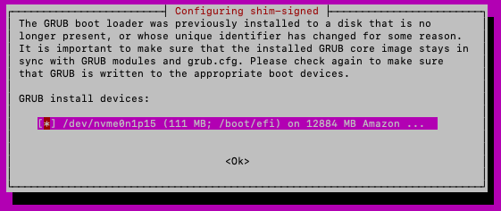
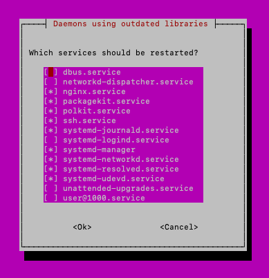

## Introduction

In this lab, we will be going through a scenario where you will need to upgrade NGINX Plus R32 to R33. Upgrading to R33
will introduce a breaking change.

The goal of this section will be to
- become familiar of the upgrade process to R33 from an older NGINX Plus version.

## FixIt Lab

Let's now go through this scenario where you will upgrade a previous R32 release to R33.

1. Open up a Web Shell to the NGINX Plus R32 instance in UDF.

1. Run the following command to upgrade to R33.
    ```shell
    sudo apt upgrade nginx-plus
    ```

1. You will note the following output indicting **nginx-plus** wasn't upgraded.
    ```shell
    ----------------------------------------------------------------------

    !!! NGINX Plus was not upgraded !!!

    NGINX Plus R33 introduces a breaking change.
    Please read about new licensing scheme and required actions here:

    https://docs.nginx.com/solutions/about-subscription-licenses

    ----------------------------------------------------------------------
    ```

1. Because this is a breaking change, you must take steps before you are allowed to complete the upgrade process.
Information relating to this is found in the URL of the output above. We will use the content from that page in this
portion of the lab.

1. Go ahead an create a blank `/etc/nginx/license.jwt` file per instructions from the solution article by running
the following command.
    ```shell
    touch /etc/nginx/license.jwt
    ```

1. Once that file is in place, re-run your upgrade command.
    ```shell
    sudo apt upgrade nginx-plus
    ```

1. You may see the following screens during the upgrade process. When you see them, select *Tab* then *Enter* to
proceed.

    

    

1. Now you've upgraded **nginx-plus**! Go ahead and run `curl localhost`. You will notice you see a `Connection refused`.
    ```shell
    ubuntu@ip-10-1-1-4:~$ curl localhost
    curl: (7) Failed to connect to localhost port 80 after 0 ms: Connection refused
    ```

1. From what you've learned in the previous labs, try to figure out why this is happening.

Is **nginx** started and why?

<Collapsible title="Solution">

The first spot to look are the **nginx** logs. Notice the following line.

```shell
ubuntu@ip-10-1-1-4:~$ sudo tail -f /var/log/nginx/error.log

2024/11/08 18:29:45 [error] 19725#19725: invalid license token
```

There is not a valid license so **nginx** does not started. Go ahead and update `/etc/nginx/license.jwt` with your valid
JWT you got in a previous section.

Once that is completed, restart **nginx**.

```shell
ubuntu@ip-10-1-1-4:~$ sudo systemctl restart nginx

ubuntu@ip-10-1-1-4:~$ sudo tail -f /var/log/nginx/error.log
2024/11/08 18:29:45 [notice] 592#592: exit
2024/11/08 18:29:45 [error] 19725#19725: invalid license token
2024/11/08 18:35:11 [notice] 19815#19815: using the "epoll" event method
2024/11/08 18:35:11 [notice] 19815#19815: nginx/1.27.2 (nginx-plus-r33)
2024/11/08 18:35:11 [notice] 19815#19815: built by gcc 11.4.0 (Ubuntu 11.4.0-1ubuntu1~22.04)
2024/11/08 18:35:11 [notice] 19815#19815: OS: Linux 6.5.0-1023-aws
2024/11/08 18:35:11 [notice] 19815#19815: getrlimit(RLIMIT_NOFILE): 1024:524288
2024/11/08 18:35:11 [notice] 19816#19816: start worker processes
2024/11/08 18:35:11 [notice] 19816#19816: start worker process 19817
2024/11/08 18:35:11 [notice] 19816#19816: start worker process 19818
```

And it finally starts! You can not proceed to configure your NGINX Plus instance.

</Collapsible>


### Upgrading note

If you've upgrade to R33 but **nginx* isn't able to reload because of an unknown directive that is new starting on R33,
try restarting instead of reloading. You may encounter a case where the **nginx** binary running in memory wasn't update
yet the binary you just installed is updated.

## Summary

After completing this lab, you are now able to:
1. Update to the R33 release.

## Conclusion

Thank you for you time for this upskill session for NGINX Plus R33.
