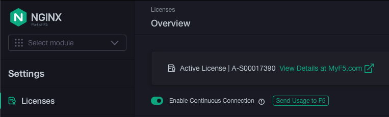

## Introduction

In this lab, we will be going through a scenario where the NGINX Plus instance is in a network restricted environment.
Since it does not have internet connectivity, it needs to be configured to use NIM and the usage report endpoint. This
lab will go through configuring this environment where NIM has internet connectivity.

The goal of this section will be to:
- Become familiar configuring NGINX Plus R33 with NIM as the usage report endpoint.

The diagram below shows the component view and a main workflow one would do from a Jumphost.

> **Note:** Although we are going through this lab as if NGINX Plus is in a network restricted environment, it really
does have internet access.

## Interactive Lab Part 2

Let's now go through this scenario where you will configure NGINX Plus so that the usage report endpoint is set to NIM.

### NIM

NIM is already installed and licensed so no need to configure anything here. You can log in NIM UI via UDF to check
the status.

1. Open up a Web Shell to the NGINX Plus R32 instance in UDF.

1. You can navigate to License Setting by selecting the Setting icon on top. You should be taken to the Licenses page.

### NGINX Plus R33

Let's now proceed to installing NGINX Plus R33 and configuring the usage report endpoint to NIM instead of the default
F5 Saas Endpoint.

## Summary

After completing this lab, you are now able to:
1. Update to the R33 release.

## Conclusion

Thank you for you time for this upskill session for NGINX Plus R33.
